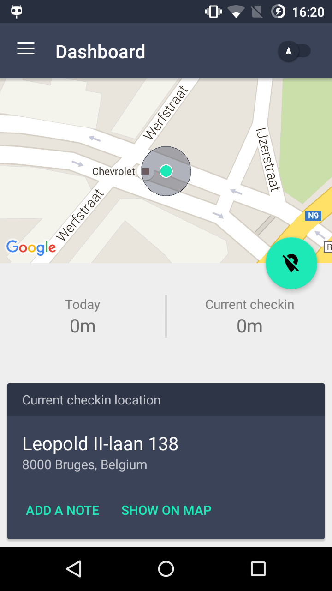

# punchtime app

> Note: this is a work in progress, and not yet a deployed app.

## screenshots

> Note: these screenshots aren't definitive

## info

This is the android client of [punchtime.io](https://punchtime.io).

Made for Projecten 1 at Odisee in Ghent

By [Haroen Viaene](https://haroen.me), [Elias Meire](http://eliasmei.re) and [Arnaud Weyts](https://weyts.xyz).

It uses Firebase to communicate the location of an employee when he arrives at a location he works at (i.e. an electrician). This is then used to calculate the amount of hours the employee worked, and also how much the clients should pay for offered services.

## Building it yourself

* fill in valid API keys in [app/src/main/values/api_keys.xml](app/src/main/values/api_keys.xml) like [app/src/main/values/api_keys.example.xml](app/src/main/values/api_keys.example.xml) for:
    * google maps
    * google oAuth
    * facebook oAuth
    * twitter oAuth

## related

- [organisation](https://github.com/punchtime/organisation)
- [web client](https://github.com/punchtime/web)

## License

Apache License 2.0
